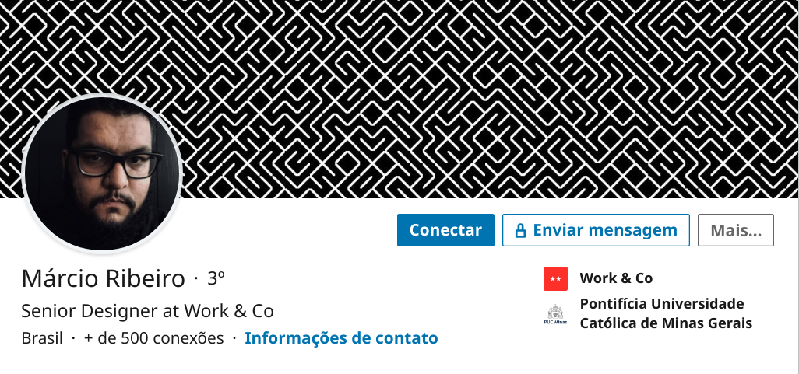
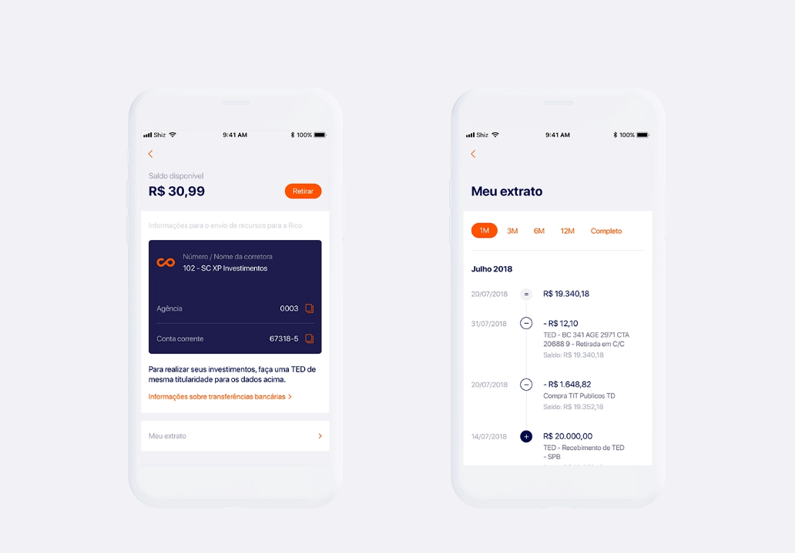

## **Protótipo**

&emsp;Tendo em mãos os requisitos levantados no processo de elicitação, o grupo encontrou um material disponibilizado pelo designer responsável pela identidade visual da aplicação.

<i>Exemplo: Perfil do linkedin de Márcio Ribeiro</i>

&emsp;Logo abaixo podemos ver um protótipo feito pelo designer que corresponde com as seguintes história de usuário

US02 - Eu como um usuário do sistema desejo realizar o login

US19 - Eu como um usuário do sistema desejo visualizar o patrimônio na rico

US20 - Eu como um usuário do sistema desejo visualizar os valores da tela inicial

US21 - Eu como um usuário do sistema desejo visualizar a distribuição de investimentos

<i>Exemplo: Protótipo de Alta Fidelidade</i>

<i>Exemplo: Protótipo de Alta Fidelidade</i>

US07

### **Histórico de Revisões**

| Data       | Responsável                                                                                          | Versão | Alteração                                                   |
| ---------- | ---------------------------------------------------------------------------------------------------- | ------ | ----------------------------------------------------------- |
| 18/11/2019 | [@dansousamelo](https://github.com/dansousamelo)                                                           | 1      | Adicionando Protótipo                                        |

## **Referências**
 * 
SERRANO, Maurício; SERRANO, Milene; Requisitos - Aula 11; Disponível em https://aprender.ead.unb.br/pluginfile.php/727236/mod_resource/content/1/Requisitos%20-%20Aula%20013a.pdf.
