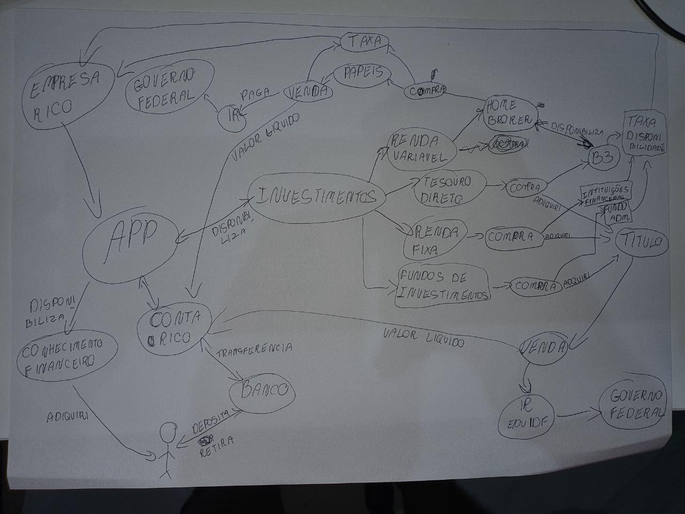
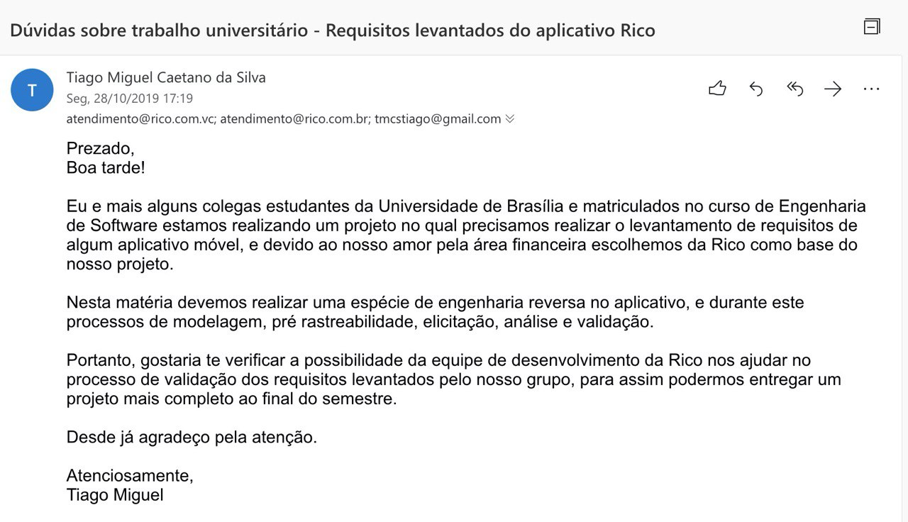

## **Validação Informal** 

### **Validação Bem Sucedida**

&emsp;Para uma validação bem sucedida, contamos com a ajuda de Juliano Almeida, um empresário responsável pela empresa PrimeCred, o mesmo possui um alto conhecimento sobre o mundo dos investimentos e das corretoras.

<i>Juliano Almeida</i>

&emsp;Foi feita uma reunião, o aluno Tiago converversou com Juliano pela ferramento hangouts em uma quinta feira, dia 21/11. Pedimos para o empresário validar o Rich Picture elaborado pela equipe

&emsp;Juliano preferiu fazer a validação desenhando um novo rich picture utilizando o nosso como base, realocando a posição dos componentes e adicionando novas. Uma nova versão do Rich Picture foi implementada, como podemos ver a seguir. O resultado podemos ver a seguir:

<i>Juliano Almeida</i>

&emsp;A partir do rascunho feito por Juliano e através da inspeção realizada no processo de verificação, uma versão final do Rich Picture foi elaborada. O resultado foi este:

### **Validação Mal Sucedida - Via Email**

Tentamos comunicação com a área de atendimento da RICO, mas não obtemos sucesso.

<i>Validação mal sucedida</i>

## **Histórico de Revisões**

| Data       | Responsável                                                                                          | Versão | Alteração                                                   |
| ---------- | ---------------------------------------------------------------------------------------------------- | ------ | ----------------------------------------------------------- |
| 18/11/2019 | [@dansousamelo](https://github.com/dansousamelo)                                                           | 1      | Adicionando validação informal mal sucedida                                        |

## **Referências**
 * 
SERRANO, Maurício; SERRANO, Milene; Requisitos - Aula 11; Disponível em https://aprender.ead.unb.br/pluginfile.php/727236/mod_resource/content/1/Requisitos%20-%20Aula%20013a.pdf.

