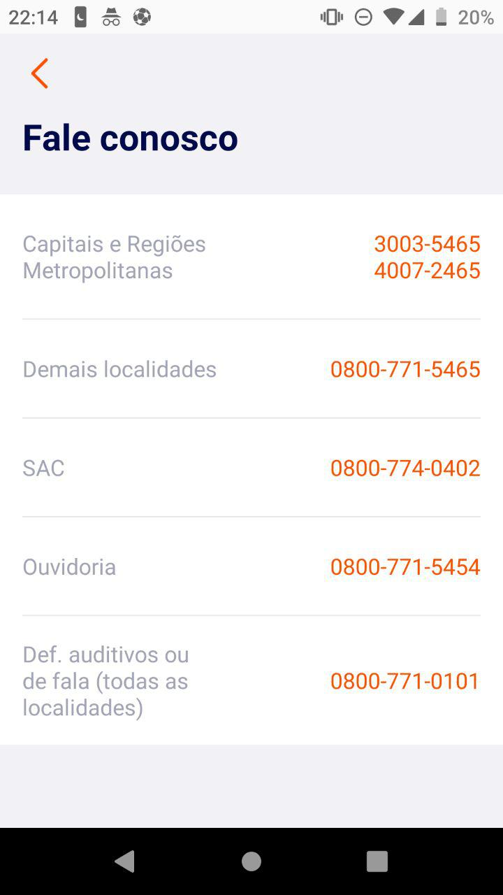

<table>
    <thead>
        <tr>
            <th colspan="2" rowspan="2"> US55 - Eu como um usuário do sistema desejo obter suporte via telefone</th>
        </tr>        
    </thead>
</table>

<table>
    <thead>
        <tr>
            <th>Regra/Critério de Aceitação</th>
            <th>Exemplo</th>
            <th>Questionamento</th>
        </tr>        
    </thead>
    <tbody>
        <tr>
            <td>O usuário deve possuir um problema ou uma dúvida</td>
            <td>
                <ul>
                    <li>O Usuário não está conseguindo realizar o pagamento e foi buscar ajuda via Telefone para saber o que estava acontecendo - OK</li>
                </ul>
            </td>
            <td>
                <ul>
                    
-

                </ul>
            </td>
        </tr>
        <tr>
            <td>O usuário deve ser capaz de visualizar opções para SAC</td>
            <td>
                <ul>
                    <li>O Usuário deseja ligar para o serviço de SAC - OK</li>
                </ul>
            </td>
            <td>
                <ul>
                    
-

                </ul>
            </td>
        </tr>
        <tr>
            <td>O usuário deve ser capaz de visualizar um número de telefone para ligar no serviço de SAC</td>
            <td>
                <ul>
                    <li>O Usuário deseja ligar para o serviço de SAC - OK</li>
                </ul>
            </td>
            <td>
                <ul>
                    
-

                </ul>
            </td>
        </tr>
        <tr>
            <td>O usuário deve ser capaz de visualizar um número de telefone para ligar no serviço de ouvidoria</td>
            <td>
                <ul>
                    <li>O Usuário possui dúvidas e deseja ligar para o serviço de ouvidoria- OK</li>
                </ul>
            </td>
            <td>
                <ul>
                    
-

                </ul>
            </td>
        </tr>
        <tr>
            <td>O usuário deve ser capaz de visualizar um número de telefone para ligar no serviço de capitais e regiões metropolitanas</td>
            <td>
                <ul>
                    <li>O Usuário não sabe o número para ligar em algumas localidade- OK</li>
                </ul>
            </td>
            <td>
                <ul>
                    
-

                </ul>
            </td>
        </tr>
        <tr>
            <td>O usuário deve ser capaz de visualizar um número de telefone para ligar no serviço para deficientes auditivos ou fala</td>
            <td>
                <ul>
                    <li>O Usuário é deficiente auditivo e deseja tirar dúvidas - OK</li>
                </ul>
            </td>
            <td>
                <ul>
                    
-

                </ul>
            </td>
        </tr>
    </tbody>
</table>

## **Imagem Representativa**

<i>Exemplo: Tela com telefones para atendimento</i>
